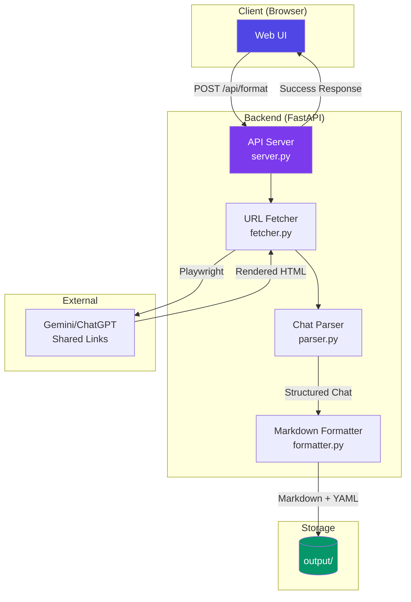

# Chat Converter

A locally-hosted web application that captures and formats conversations from ChatGPT, Gemini, and Claude into clean, structured Markdown files with metadata.

## What It Does

This tool solves the problem of archiving and formatting your LLM conversations. Instead of manually copying chat transcripts or losing them when they expire, you can:

1. **Paste a shared link** from ChatGPT or Gemini
2. **Add custom notes** for context or categorization
3. **Get a formatted Markdown file** with proper metadata, preserved formatting (tables, lists, code blocks), and timestamped automatically

All processing happens **locally on your machine**—no data leaves your server.

---

## Architecture Overview



---

## Component Breakdown

### 1. **Frontend** (`static/`)
- **`index.html`**: Clean, dark-themed UI with URL input and notes textarea
- **`styles.css`**: Modern design with glassmorphism and responsive layout
- **`app.js`**: Form handling, API calls, chat list display

### 2. **Backend** (`src/`)

#### **`server.py`** - FastAPI Application
- **Endpoints**:
  - `POST /api/format` - Format a chat from URL
  - `GET /api/chats` - List all saved chats
  - `GET /api/chats/{filename}` - Download specific chat
- Serves static frontend and handles chat processing workflow

#### **`fetcher.py`** - URL Content Fetcher
- Uses **Playwright** to fetch JavaScript-rendered pages
- **GDPR Consent Handler**: Automatically clicks through Google's cookie consent pages
- Returns fully-rendered HTML for parsing

#### **`parser.py`** - Chat Content Parser
- **Multi-platform support**:
  - ChatGPT: Uses `data-message-author-role` attributes
  - Gemini: Uses `.user-query-container` and `.message-content` classes
  - Generic fallback: Heuristic-based role detection
- **Content preservation**:
  - Tables → Markdown tables
  - Lists → Markdown lists
  - Code blocks → Fenced code blocks with language tags

#### **`formatter.py`** - Markdown Export
- Generates Markdown with **YAML frontmatter**:
  ```yaml
  ---
  title: "Chat Title"
  date: 2026-01-21
  time: "18:00"
  source_url: "https://..."
  notes: "Your custom notes"
  ---
  ```
- Handles filename generation and duplicate prevention

### 3. **Storage** (`output/`)
Markdown files saved with format: `YYYY-MM-DD_sanitized-title.md`

---

## How It Works

1. **User submits URL** via web interface
2. **Playwright fetches** the page (handles JS rendering, GDPR consent)
3. **Parser extracts** messages with role detection (User/Assistant)
4. **Formatter generates** Markdown with metadata
5. **File saved** to `output/` directory
6. **Response sent** to frontend with preview

---

## Requirements

- Python 3.10+
- Playwright (with Chromium browser)
- FastAPI + Uvicorn
- BeautifulSoup4

---

## Quick Start

```bash
# Install dependencies
uv sync

# Install Playwright browsers
uv run python -m playwright install chromium

# Start server (accessible via Tailscale at 0.0.0.0:8080)
./run.sh
```

Open http://localhost:8080 in your browser.

---

## Agent-Friendly API

All actions available in the UI are exposed as simple HTTP endpoints so agents can trigger, search, and download chats programmatically.

### Trigger a capture
```bash
curl -X POST http://localhost:8080/api/format \
  -H "Content-Type: application/json" \
  -d '{"url":"https://gemini.google.com/share/...", "notes":"optional context"}'
```

### Upload a chat (HTML)
```bash
# create JSON from a saved HTML file and upload it
python - <<'PY' | curl -X POST http://localhost:8080/api/upload -H "Content-Type: application/json" -d @-
import json, pathlib
payload = {
    "html": pathlib.Path("chat.html").read_text(encoding="utf-8"),
    "notes": "optional context",
    "source_url": "https://gemini.google.com/share/...",
    "title": "Optional override title",
}
print(json.dumps(payload))
PY
```

### Search + filter saved chats
```bash
# keyword search + filters
curl "http://localhost:8080/api/chats?q=alignment+persona&platform=gemini&timeframe=30d"

# list everything
curl "http://localhost:8080/api/chats"
```

**Filters**
- `platform`: `chatgpt`, `gemini`, `claude`, `unknown`, or `all`
- `timeframe`: `7d`, `30d`, `90d`, `365d`, or `all`

### Download or inspect a saved chat
```bash
# raw markdown file
curl -O "http://localhost:8080/api/chats/<filename>.md"

# JSON with metadata + content
curl "http://localhost:8080/api/chats/<filename>.md/json"
```

---

## MCP Server (Model Context Protocol)

This repo includes an MCP server that exposes the same capabilities as tools and resources for agents.

### Run (stdio)
```bash
uv run python -m src.mcp_server
```

### Run (streamable HTTP)
```bash
MCP_TRANSPORT=streamable-http MCP_HOST=0.0.0.0 MCP_PORT=8090 uv run python -m src.mcp_server
```

Connect to `http://localhost:8090/mcp`.

### MCP tools
- `format_chat_from_url(url, notes="")`
- `upload_chat_html(html, notes="", source_url="", title="")`
- `list_chats(q="", platform="all", timeframe="all")`
- `get_chat_markdown(filename)`
- `get_chat_json(filename)`

### MCP resources
- `orientation://chat-converter`

---

## Features

✅ **Smart Parsing**: Detects ChatGPT, Gemini, and generic chat structures  
✅ **Format Preservation**: Tables, lists, and code blocks are converted to Markdown  
✅ **Metadata Extraction**: Auto-captures title, date, and time  
✅ **Custom Notes**: Add context or tags to each saved chat  
✅ **GDPR Handling**: Bypasses Google consent pages automatically  
✅ **Privacy First**: All processing is local—no external API calls  
✅ **Tailscale Ready**: Accessible across your private network  

---

## Example Output

```markdown
---
title: "Aligning AI to Your Thinking Style"
date: 2026-01-21
time: "18:22"
source_url: "https://gemini.google.com/share/..."
notes: "metacognition research"
---

## User
How can I get my model to think like me

---

## Assistant
There are several approaches to persona alignment...
```

---

## Limitations

- **Shared links only**: Private chats require manual HTML saving
- **JavaScript required**: Uses Playwright (heavier than simple HTTP)
- **Platform-specific**: Parser tuned for ChatGPT/Gemini structures (may need updates if they change their HTML)

---

## Automated Deployment

This project includes automated deployment via GitHub Actions. Every push to the `main` branch automatically deploys to the server.

### Initial Setup (One-Time)

**1. Generate SSH key for GitHub Actions**
```bash
ssh-keygen -t ed25519 -C "github-actions@chat-converter" -f ~/.ssh/github_actions_chat_converter -N ""
```

**2. Add public key to server**
```bash
ssh-copy-id -i ~/.ssh/github_actions_chat_converter.pub talha@192.168.0.102
```

**3. Test SSH connection**
```bash
ssh -i ~/.ssh/github_actions_chat_converter talha@192.168.0.102 "echo 'Connection successful'"
```

**4. Add private key to GitHub Secrets**
- Navigate to: `https://github.com/talhas-laboratory/chat_converter/settings/secrets/actions`
- Click **New repository secret**
- Name: `SERVER_SSH_KEY`
- Value: Contents of `~/.ssh/github_actions_chat_converter` (private key)

### How It Works

When you push to `main`:
1. GitHub Actions triggers the workflow
2. Connects to your server via SSH
3. Pulls latest code from the repository
4. Rebuilds Docker images using docker-compose
5. Restarts containers with new images
6. Verifies deployment success

### Monitor Deployments

View deployment status at: `https://github.com/talhas-laboratory/chat_converter/actions`

### Manual Deployment

If needed, you can deploy manually using the deployment script:

```bash
# On the server
cd /home/talha/curated_context_containers/docker/chat_converter
./deploy.sh

# Test deployment locally first (dry-run)
./deploy.sh --dry-run
```

---

## Future Enhancements

- HTML file upload support (for private chats)
- Claude shared link support
- PDF export option
- Obsidian-compatible frontmatter
